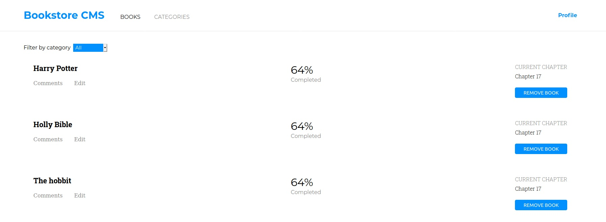

<h1 align="center">React Project Bookstore</h1>

  

# :arrow_right: [Live Demo](https://dieju-bookstore-cms.herokuapp.com/)

## Authors

:man: Diego Antonio Reyes Coronado

- Github: [@xtrmdarc](https://github.com/xtrmdarc)
- Twitter: [@diegoreyesco](https://twitter.com/DiegoAn91629127)
- Linkedin: [diegoreyesco](https://www.linkedin.com/in/diego-reyes-coronado)

:man: Julian Belmonte

- Github: [Julian Belmonte](https://github.com/jucora)
- Twitter: [@Julian Belmonte]((https://www.twitter.com/JulianBelmonte)
- Linkedin: [Julian Belmonte]((https://www.linkedin.com/in/julianbel)

## :pencil: Main Description

This project consists of building the front-end of an application that will help a fictional company to organize and manage their bookstore. In order to make the app fast, dynamic and responsive to their actions, the implementation of React & Redux is required. This project is part of the main Microverse curriculum for the React course.

For more information about the project requirements, please follow the next link: [React Project Bookstore](https://github.com/microverseinc/project-redux-bookstore)

## How to install the App

1. Please clone the repository by running the next comand in your machine:

<pre><code>git clone https://github.com/xtrmdarc/bookstore-cms.git</code></pre>

2. Next, run the next command to install all project dependencies:

   For Yarn: <pre><code>yarn install</code></pre>
   For npm: <pre><code>npm install</code></pre>

## How to run the app locally

1. Get into the folder of the project by running the next command:

<pre><code>cd bookstore-cms</code></pre>

2. Start your local server by running the next command:

   For Yarn: <pre><code>yarn start</code></pre>
   For npm: <pre><code>npm start</code></pre>

## :computer: Library, Languages and technologies

- React
- React-DOM
- Redux
- JSX
- CSS
- Node.js
- prop-types
- npm
- Javascript

## Report Issues

Please feel free to make a contribution, report any issue, feature request or provide any feedback. Click [here](https://github.com/xtrmdarc/bookstore-cms/issues)

## Support

Feel free to drop a like, that would support us a lot.
